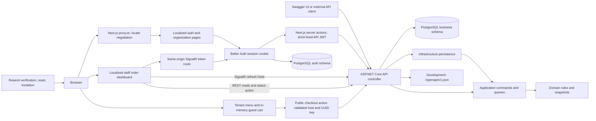

# WhitePlate system architecture

Status: email/password and Google/Microsoft auth, localized recovery and verification pages, organization signup, email-bound invitations, server-side API JWT exchange, backend identity verification, and the staff kitchen dashboard are wired in source. The API solution tests pass after correcting the migration-count assertion; dashboard automated tests are recorded in the functional test plan. Better Auth's `auth` schema and the invitation-email EF migration are applied on Neon `test`; email/password signup and invitation acceptance are verified there with locally intercepted email. Authenticated dashboard browser acceptance, live provider/email, and production operations checks remain open.

## Current runtime



The Next.js BFF calls protected API endpoints server-side and never returns API bearer tokens to client JavaScript. Better Auth sessions use an HttpOnly cookie; Better Auth stores auth records/signing keys in its separate PostgreSQL `auth` schema and issues RS256 JWTs. The API validates issuer, audience and JWKS, then uses persisted organization/restaurant membership for authorization.

## Repository map

```text
WhitePlate/
  AGENTS.md
  readme.md
  package.json                     # Metadata; not an npm workspace
  apps/
    frontend/
      app/[locale]/                # Localized layout and starter page
      app/globals.css              # Tailwind 4 and light/dark tokens
      components/                  # Theme provider and UI button
      i18n/                        # Routing, navigation, request configuration
      messages/                    # English and French catalogs
      lib/utils.ts                 # cn re-export
      proxy.ts                     # Locale routing only
      package.json
      package-lock.json
    api/
      WhitePlate.slnx            # All four projects plus tests
      WhitePlate.Domain/           # Organization, tenant, identity, catalog and order rules
      WhitePlate.Application/      # Use cases and narrow repository ports
      WhitePlate.Infrastructure/   # EF Core persistence
      tests/WhitePlate.Tests/      # xUnit v3 layer and API tests
      .dockerignore                # API-wide Docker build context
      WhitePlate.Api/
        WhitePlate.Api.csproj      # ASP.NET Core host targeting net10.0
        Program.cs                 # HTTP pipeline and composition root
        Properties/launchSettings.json
        appsettings.json
        appsettings.Development.json
        WhitePlate.Api.http        # Sample request
        Dockerfile
  docs/
  infrastructure/                  # Local placeholder directories only
```

Empty directories are not preserved by Git unless given a tracked file. Build output and IDE files are not architecture components.

## Frontend boundary

The Next.js App Router app renders `/en` and `/fr`. `next-intl` resolves the locale and supplies messages; `next-themes` manages the theme. Source folders sit directly under `apps/frontend`, and `@/*` points there. The localized organization area includes a server-backed kitchen order list and a SignalR client that treats notifications as REST refresh hints. See [frontend architecture](WHITEPLATE_FRONTEND_ARCHITECTURE.md) for the request lifecycle.

Auth BFF route handlers and API server actions are implemented. Public storefront requests validate a one-label tenant subdomain and use a fixed server-side API URL template; the menu is rendered server-side and accepts any restaurant-enabled locale independently of the app's `/en` and `/fr` interface. Owners/managers configure menu languages and edit category, product, and option translations through the localized organization area. The API persists locale settings/translations and falls back to the default menu language. Catalog localization and nullable order-locale migrations are applied to Neon `test` and Coolify Production; hosted tenant storefront and order acceptance remain open. The guest storefront submits the menu locale with an in-memory cart through a same-origin checkout server action, with UUID idempotency keys, uncertain-response retry locking, and a server-priced localized receipt. The API scope has no persisted cart. The kitchen dashboard uses authorized paged REST reads, saved localized order labels, conditional status actions, and SignalR refresh hints with REST recovery after reconnect. Custom domains remain deferred; browser acceptance and deployment configuration for the dashboard and checkout remain open. See [decisions 0003 and 0004](decisions/0003-catalog-localization-and-tenant-domain-policy.md).

## API boundary

`Program.cs` registers controllers, OpenAPI/Swagger UI, Better Auth JWT bearer validation, authorization, CORS, tenant resolution, EF Core repositories, SignalR, and the hosted outbox dispatcher. OpenAPI is mapped in Development or when explicitly enabled. Production startup requires issuer and audience. See [backend architecture](WHITEPLATE_BACKEND_ARCHITECTURE.md), [API contracts](../api/api-contracts.md), and [development](../development.md).

The separate projects and inward dependency direction are implemented and tested. The Better Auth issuer/JWKS integration is wired; the auth schema and invitation-email migration are applied on Neon `test`, and the local email/password signup/invitation path was verified. Vercel Production has completed hosted email/password signup and verification, organization listing, an authenticated protected API request, restaurant creation, and owner access to the restaurant's empty kitchen page against Coolify PostgreSQL over verified TLS. The operator reports that signed-out and alternate-account visits to the protected restaurant route redirected to `/fr?error=invalid_code`; this hosted access-denial behavior is accepted without further verification. OAuth and broader real Resend delivery, tenant DNS/TLS, durable operations, and staff-role browser checks remain open.

## Runtime and deployment

Run the apps independently using the [development guide](../development.md). The root npm package has no orchestration scripts. GitHub Actions runs the frontend and API checks separately. The API has public dependency-free liveness and database-readiness probes; the root GET/HEAD response remains available for Render service probes. The API has a multistage Linux Dockerfile with `apps/api` as its build context to include sibling projects. There is no repository full-stack Compose file or frontend Dockerfile. The selected hosted development topology is Vercel frontend plus Coolify API/PostgreSQL and its TLS proxy. The application cutover is deployed; account, tenant, and operational acceptance remain in progress. See [decision 0005](decisions/0005-coolify-hosting.md) and the [runbook](../deployment/coolify.md).

## Implemented business architecture

The product direction is a shared-schema, multi-tenant restaurant service with a Next.js storefront/dashboard, an ASP.NET Core API, PostgreSQL persistence, and SignalR order notifications. The Vercel frontend, Coolify API/PostgreSQL and Better Auth runtime are deployed; authenticated browser acceptance, public tenant DNS/TLS, and production operations remain open.

The project boundaries own these business features:

- Domain: organization, staff, catalog/pricing, and order invariants/snapshots without web or ORM dependencies.
- Application: use cases, validation, membership authorization, DTOs, and infrastructure/event publisher interfaces.
- Infrastructure: PostgreSQL persistence, transaction boundaries, idempotency, and leased outbox storage.
- API host: HTTP/authentication contracts, tenant context, SignalR hub authorization, and composition of services.

The sample query uses a plain handler. CQRS does not require MediatR, a generic repository, or a new project per feature. The tenant feature establishes plain handlers, typed results and focused repositories; remaining business choices are tracked in the [roadmap](../development-roadmap.md).

Public checkout resolves the restaurant from its host, validates products/options and computes prices on the server, then commits the order and outbox together. The dispatcher notifies authorized kitchen clients with at-least-once delivery. Reconnect recovery reads authoritative state through the staff order list.

Read [tenant boundaries](tenancy-and-security.md), [API contracts](../api/api-contracts.md), and [database schema](../database/database-schema.md) together when extending this flow.
