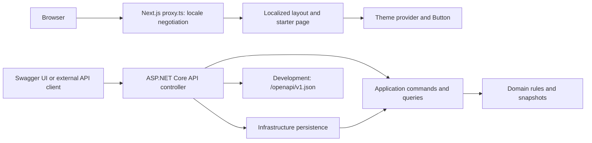

# WhitePlate system architecture

Status: organization/staff, tenant menus and catalog management, checkout, order workflow, idempotency, transactional outbox, and SignalR server delivery are implemented. The Neon test branch and local Swagger have been verified. Frontend integration and deployment-specific OIDC/domain configuration remain open.

## Current runtime



The frontend does not call the API today. The API uses EF Core/PostgreSQL, host resolution, external OIDC token validation, organization ownership, staff memberships, tenant menu and catalog management, public checkout, staff order workflow, tenant-scoped idempotency, transactional outbox delivery, and SignalR subscriptions.

## Repository map

```text
WhitePlate/
  AGENTS.md
  readme.md
  package.json                     # Metadata; not an npm workspace
  apps/
    frontend/
      app/[locale]/                # Localized layout and starter page
      app/globals.css              # Tailwind 4 and light/dark tokens
      components/                  # Theme provider and UI button
      i18n/                        # Routing, navigation, request configuration
      messages/                    # English and French catalogs
      lib/utils.ts                 # cn re-export
      proxy.ts                     # Locale routing only
      package.json
      package-lock.json
    api/
      WhitePlate.slnx            # All four projects plus tests
      WhitePlate.Domain/           # Organization, tenant, identity, catalog and order rules
      WhitePlate.Application/      # Use cases and narrow repository ports
      WhitePlate.Infrastructure/   # EF Core persistence
      tests/WhitePlate.Tests/      # xUnit v3 layer and API tests
      .dockerignore                # API-wide Docker build context
      WhitePlate.Api/
        WhitePlate.Api.csproj      # ASP.NET Core host targeting net10.0
        Program.cs                 # HTTP pipeline and composition root
        Properties/launchSettings.json
        appsettings.json
        appsettings.Development.json
        WhitePlate.Api.http        # Sample request
        Dockerfile
  docs/
  infrastructure/                  # Local placeholder directories only
```

Empty directories are not preserved by Git unless given a tracked file. Build output and IDE files are not architecture components.

## Frontend boundary

The Next.js App Router app renders `/en` and `/fr`. `next-intl` resolves the locale and supplies messages; `next-themes` manages the theme. Source folders sit directly under `apps/frontend`, and `@/*` points there. See [frontend architecture](WHITEPLATE_FRONTEND_ARCHITECTURE.md) for the request lifecycle.

Axios, TanStack Query, Zustand, and the SignalR client are installed but not integrated. No BFF route handlers, Query provider, cart store, backend URL, tenant routing, or restaurant UI exists. The approved API scope has no persisted cart.

## API boundary

`Program.cs` registers controllers, OpenAPI/Swagger UI, OIDC authentication/authorization, CORS, tenant resolution, EF Core repositories, SignalR, and the hosted outbox dispatcher. OpenAPI is mapped in Development or when explicitly enabled. See [backend architecture](WHITEPLATE_BACKEND_ARCHITECTURE.md), [API contracts](../api/api-contracts.md), and [development](../development.md).

The separate projects and inward dependency direction are implemented and tested. EF Core migrations, centralized errors, OIDC bearer validation, CORS, tenant-owned organization/staff/catalog/order data, checkout/idempotency, order concurrency, and the outbox/SignalR server path are wired. The application still needs deployment configuration for a real OIDC issuer, tenant DNS/TLS, CORS origins, and production migrations.

## Runtime and deployment

Run the apps independently using the [development guide](../development.md). The root npm package has no orchestration scripts. The API has a multistage Linux Dockerfile with `apps/api` as its build context to include sibling projects. There is no full-stack Compose file, frontend Dockerfile, PostgreSQL instance configuration, reverse proxy, or GitHub Actions workflow.

## Implemented business architecture

The product direction is a shared-schema, multi-tenant restaurant service with a Next.js storefront/dashboard, an ASP.NET Core API, PostgreSQL persistence, and SignalR order notifications. The backend behavior is implemented; no frontend integration or public production deployment exists.

The project boundaries own these business features:

- Domain: organization, staff, catalog/pricing, and order invariants/snapshots without web or ORM dependencies.
- Application: use cases, validation, membership authorization, DTOs, and infrastructure/event publisher interfaces.
- Infrastructure: PostgreSQL persistence, transaction boundaries, idempotency, and leased outbox storage.
- API host: HTTP/authentication contracts, tenant context, SignalR hub authorization, and composition of services.

The sample query uses a plain handler. CQRS does not require MediatR, a generic repository, or a new project per feature. The tenant feature establishes plain handlers, typed results and focused repositories; remaining business choices are tracked in the [roadmap](../development-roadmap.md).

Public checkout resolves the restaurant from its host, validates products/options and computes prices on the server, then commits the order and outbox together. The dispatcher notifies authorized kitchen clients with at-least-once delivery. Reconnect recovery reads authoritative state through the staff order list.

Read [tenant boundaries](tenancy-and-security.md), [API contracts](../api/api-contracts.md), and [database schema](../database/database-schema.md) together when extending this flow.
