# Landing and demo menu responsive UX audit

8 October 2026 · `fix/landing-demo-responsive` · [issue #55](https://github.com/whritou/WhitePlate/issues/55).

## Scope and result

Audited the public landing (`/en`, `/fr`) and menu (`/en/demo`, `/fr/demo`), from navigation through the footer, including menu filtering, search, cart access, quantities and empty results. The goal is readable content and reachable actions without document overflow, compressed text or controls touching their containers. Responsive defects found in this scope are fixed. The demo continues to use illustrative products and an in-memory order.

The existing visual identity, semantic colors, shared Button/Card primitives, local fonts and EN/FR catalogs were retained. No global tokens or dependencies changed. Layouts use 16px mobile gutters, 24px small-screen gutters and 32px desktop gutters. Larger multi-column layouts wait until their content fits. The existing compact 26px mobile hero heading is retained; section headings now use that existing mobile token too. This is scoped responsive adoption, not a replacement global typography scale.

## Findings and implemented fixes

Severity describes the observed defect before this change: high blocks or obscures a primary task; medium harms readability or reliable operation; low is visual inconsistency.

| Step | Severity | Observed problem and reproduction | Fix and evidence |
| --- | --- | --- | --- |
| 1. Landing entry | Medium | At 1024px in French, the hero split into two narrow columns. The signup action grew to about 124px while the adjacent demo action stayed about 54px. | Hero splits at 1280px. Shared buttons have matching geometry and equal-height grid tracks; text can wrap. Tablet and mobile hero checks cover action height. |
| 1. Navigation | Medium | Mobile locale links measured 36px. Escape left the expanded navigation open. | Locale targets are at least 44px; navigation closes on Escape and restores trigger focus. The expanded menu scrolls within the available viewport. Full navigation waits until 1536px. |
| 2. Hero preview | Medium | French KPI values/statuses escaped their cards at 1024px; narrow order rows squeezed names into a vertical strip beside their action. | KPI value rows wrap; order content reserves useful width and moves actions below when needed. Preview footer and storefront products reflow. |
| 3. Preview controls | Medium | Clicking Customer Web swapped the preview, but the white active background and bold label stayed on Kitchen KDS. Both buttons also had a 4px corner radius inside a 16px rounded rail. | Both tabs derive the active background, text and weight from the same selected state; inactive styling follows the other tab. Buttons now use a 12px inset radius. Production preview shows the selected panel and tab moving together in either direction. |
| 2. Metrics and features | Medium | Long French headings, fixed grids and large insets consumed mobile content width. Enlarged text could widen the page. | Mobile heading scale, smaller card insets, content-aware metric tracks and later feature columns. Long words can wrap within the public surfaces. |
| 3. Kitchen/customer previews | Medium | The ticket columns, status stages and payment row competed for narrow-screen space. Apple Pay's light background could leave its white label unreadable. | Ticket columns stack on mobile; metadata wraps; stages use two columns; payment actions stack. Apple Pay uses the existing obsidian surface. |
| 4. Pricing | Medium | Three pricing columns started at tablet width. The absolute popular badge and oversized insets crowded localized plan headings; the billing control was only 28px high. | Plans remain stacked below 1024px. The badge participates in layout, titles/prices wrap, and actions use shared buttons. Billing target is at least 44px with visible focus. |
| 5. FAQ, CTA and footer | Medium | Large headings, early horizontal CTA layout and small footer links reduced mobile usability. | Smaller mobile headings, stacked CTA until 1280px, matched CTA buttons, responsive footer columns and at least 44px link heights. FAQ expansion was visually exercised. |
| 6. Restaurant identity | Medium | Logo, name, metadata and actions competed in a horizontal mobile row. | Identity stacks on phones; metadata uses one/two columns before the full desktop row; share/favorite controls wrap. |
| 6. Menu controls | High | The mobile category controls occupied about 176px, with search beneath them, and stayed sticky while browsing. Long French drink labels also clipped inside their button. | Categories scroll locally in one row, long labels can wrap, and the controls become sticky only from 1024px. The tested navigation height is at most 64px at 320px. |
| 6. Desktop search | High | The final visual pass found the desktop search collapsed to 48px. `max-w-sm` resolved through a project spacing token rather than the intended input width. | The local cap is explicitly 24rem; a regression requires at least 320px of search width at a 1280px viewport. No shared token was changed. |
| 7. Menu products | High | Add actions touched the bottom edge: the shared Card's conditional footer rule overrode `p-4`, leaving an actual bottom inset of 0px. | Matching conditional padding preserves 16px below every product action. Browser assertions measure bottom and right insets on all six cards. |
| 7. Product readability | Medium | Clamped descriptions lost useful information. At 200% root text, names could have only 8px beside their image. A 360px sidebar started too early. | Descriptions remain visible, images stack when text needs space, product title width is tested, and the order sidebar starts at 1280px. |
| 8. Order access | High | On phones the order summary followed the entire menu, with no persistent indication of the current order or direct path to it. | A bottom shortcut below 1280px shows localized count and total, scrolls/focuses the order, and respects the device safe area. Page bottom space keeps the last content reachable. |
| 8. Cart layout/state | Medium | Long product names, prices and quantity controls competed for width; summary/footer padding inherited the same Card rule. | Names, prices, controls and totals wrap independently; summary padding is explicit. Count updates use a polite live region. Search, empty results, add, increase and remove were exercised. |

## Captured walkthrough

Screenshots below were captured in this audit run using the browser, saved locally and inspected. Before images show the development baseline; final images show the production preview unless indicated. Viewport dimensions are CSS pixels. An image shows one viewport, so adjacent content can continue below it.

### 1. Enter and navigate — corrected

Before, French landing at 1024px: mismatched action heights and leaking KPI labels.

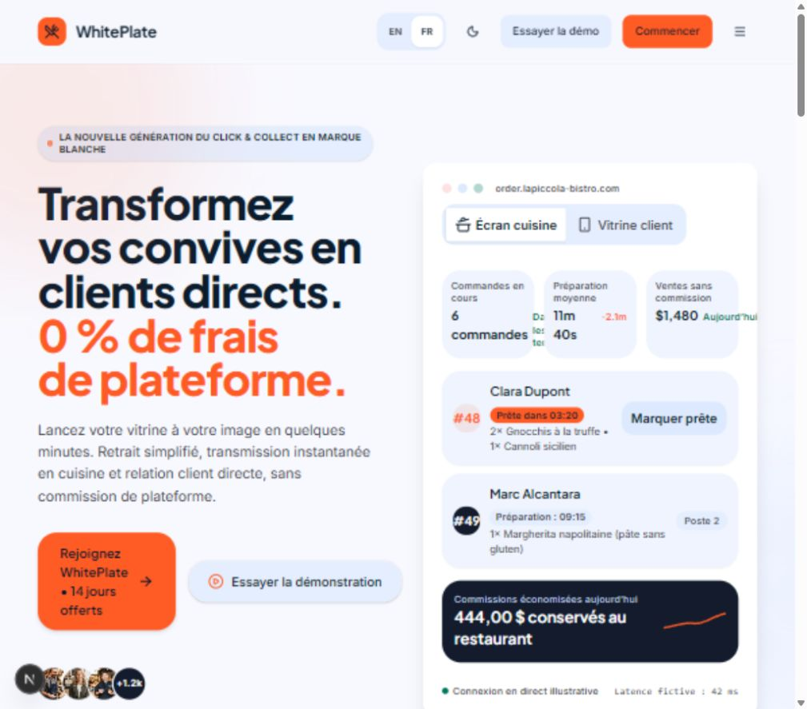

Final mobile hero at 375px: aligned gutters, compact heading and matched actions.

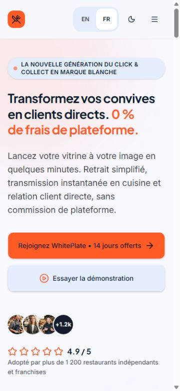

### 2. Read features and metrics — corrected

Final feature section at 375px, development preview: readable line lengths and room inside the card. The content and classes are also present in the verified production build.

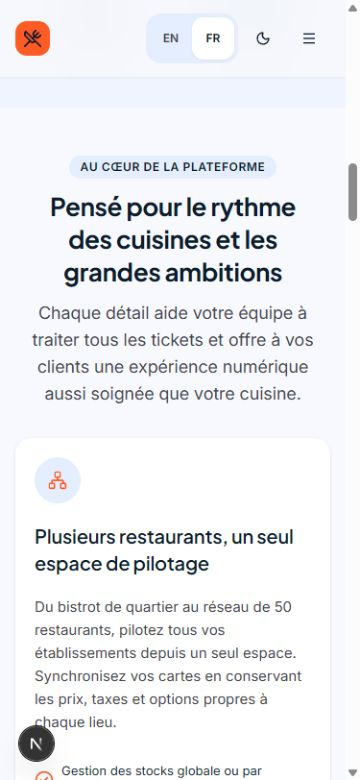

### 3. Explore the product previews — corrected

Final kitchen and customer previews at 375px: stacked tickets, wrapping labels and a readable payment action.

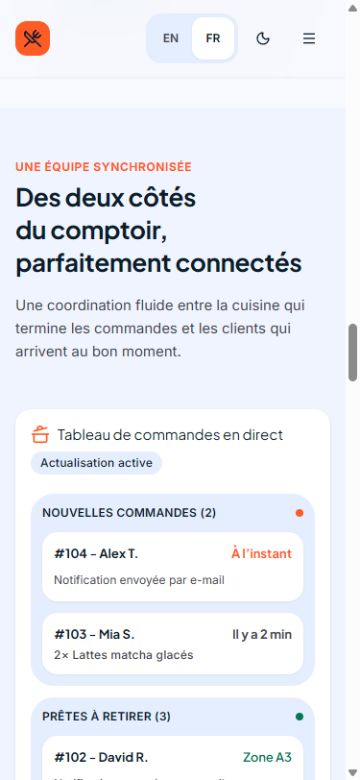
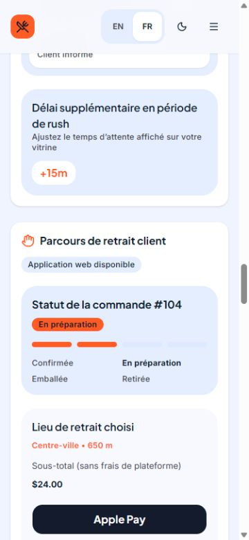

Follow-up interaction check at 1280px: Customer Web is visibly selected while the customer storefront panel is shown. Kitchen KDS and its panel were then selected again. Both active and inactive buttons keep the same nested rounded shape.

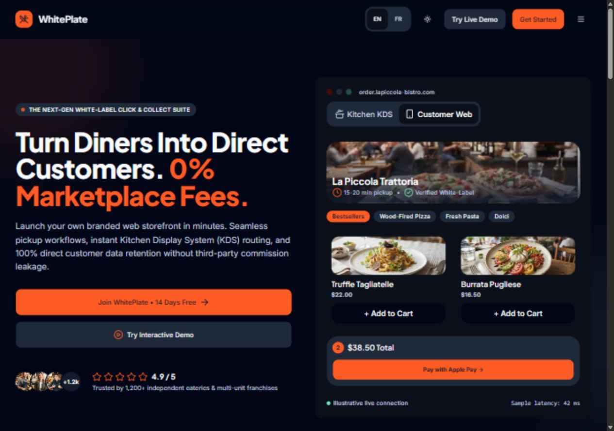

### 4. Compare plans — corrected

Plan headings, billing toggle, in-flow popular badge and localized actions are covered by the responsive suite. The mobile visual pass confirmed the stacked plan presentation; pricing remains illustrative, as documented in the redesign handoff.

Final dark pricing at 375px, with annual billing selected and the popular plan badge inside its card.

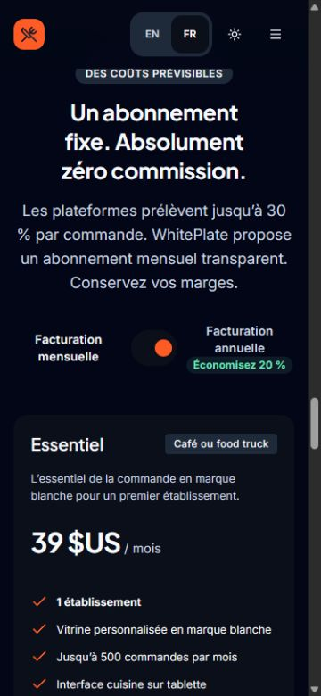
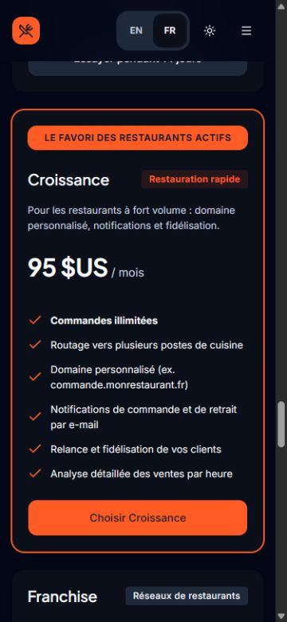

### 5. Read answers and continue — corrected

Final expanded FAQ and CTA at 375px: answer text stays readable and both CTA labels remain inside matching button surfaces.

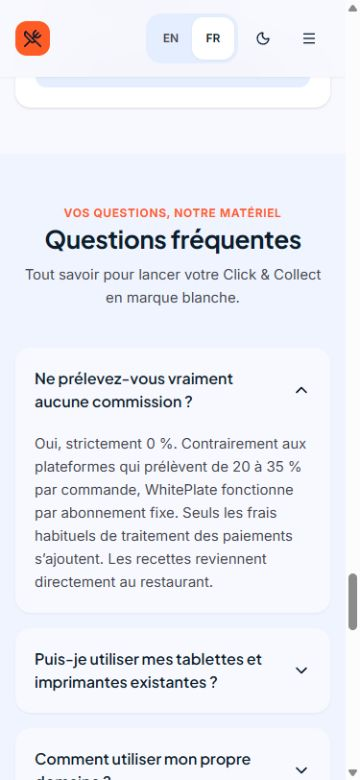

### 6. Open the restaurant menu — corrected

Final restaurant identity at 375px: stacked identity, retained cover image and persistent order access.

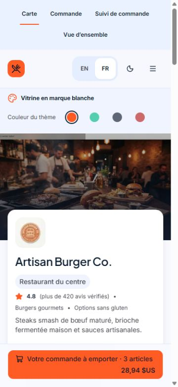

### 7. Filter and choose products — corrected

Before at 375px: tall sticky category block, clipped product copy and add action flush with the card edge.

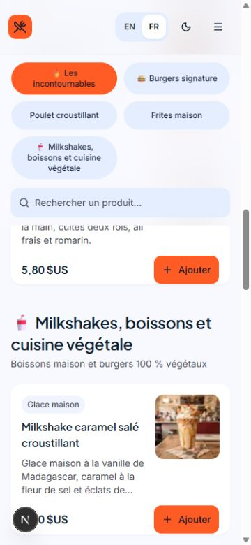

Final at 375px: locally scrolling categories, full descriptions and 16px action insets.

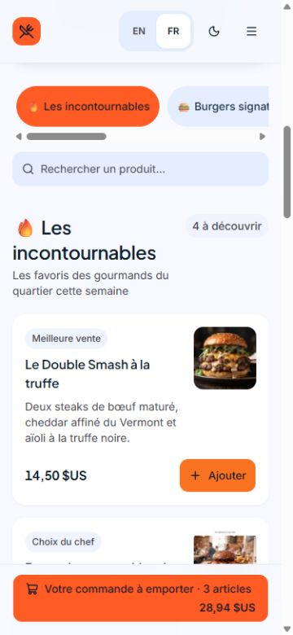

Final English/dark menu at 1280px: a usable 384px search field, two product columns and a separate order summary.

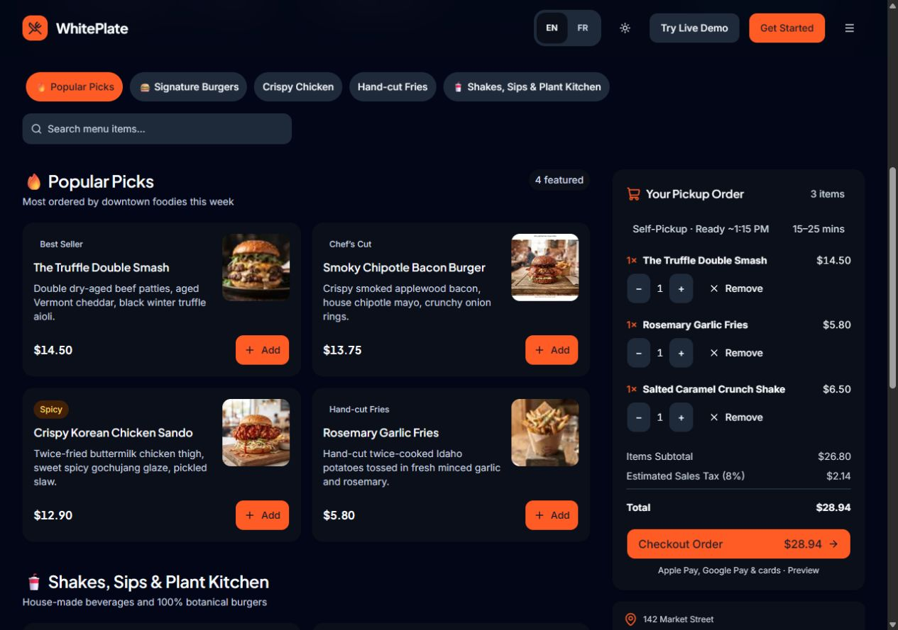

### 8. Review the order — corrected

Final at 375px after adding a burger: four items, readable quantities/prices and a reachable checkout action. The menu total is $44.60 before the separate checkout discount preview.

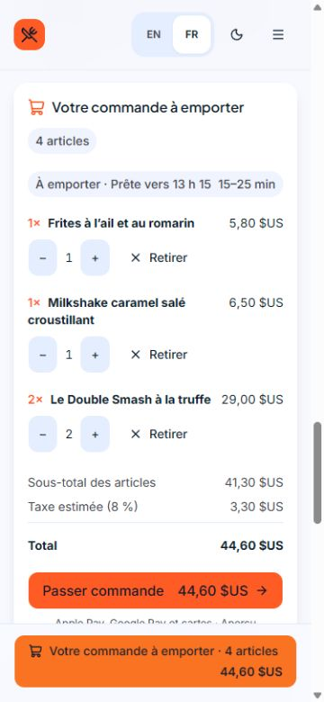

## Verification

Commands ran from `apps/frontend` using installed CLI entry points because npm is unavailable on PATH. No database fixture or API mutation was required.

| Check | Actual result |
| --- | --- |
| `node node_modules/vitest/vitest.mjs run` | 58 files / 387 tests passed. |
| `node node_modules/eslint/bin/eslint.js .` | Passed after correcting spacing in the new test file. |
| `node node_modules/typescript/bin/tsc --noEmit` | Passed; the production build also completed TypeScript checking. |
| `node node_modules/playwright/cli.js test --project=responsive-layout --reporter=line` | 25 passed on the development server, including the existing broader route checks. The subsequent desktop-search regression passed separately after the width correction. |
| `$env:WHITEPLATE_ACCEPTANCE_URL='http://localhost:3001'; node node_modules/playwright/cli.js test tests/browser/public-responsive.spec.ts --project=responsive-layout --reporter=line` | Final build: 14 passed (42.6s). The first production attempt had one loading-state measurement failure; tests now wait for the main heading. The new desktop-search test first failed at 48px, then passed at 384px. |
| Scoped Prettier check | Passed on changed components, configuration and browser specs. |
| Whole-package `node node_modules/prettier/bin/prettier.cjs --check "**/*.{ts,tsx}"` | Final check failed on 193 existing files outside this task. The earlier run reported 194, including the then-unformatted new spec, which was corrected. Unrelated files were left intact. |
| `node node_modules/next/dist/bin/next build --webpack` | Final search-width rebuild passed with 57 generated pages. Used inert HTTPS auth/API origins and an intentionally unreachable local database. Non-blocking webpack cache `EPERM` and Better Auth schema-validation diagnostics were logged. This does not verify database connectivity. |
| Landing preview tab follow-up | Production preview on the rebuilt output: selected Customer Web and then Kitchen KDS. The active white surface and bold label followed each selection, each corresponding panel matched the selection, and both buttons computed to 12px corner radii inside the 16px rail. |
| `py -3 docs/design-system/verify.py` from root | Passed: 86 contrast pairs, CSS/token parity, palette parity and documentation link scans. This is token verification, not complete accessibility certification. |
| `git diff --check` | Passed. |

The public matrix covers 320, 375, 639, 640, 768, 1023, 1024, 1279, 1280, 1440 and 1536px, both locales and both themes, and checks document overflow and clipped headings. French 200% root-text checks run at 320/768px, including useful product-title width. Focused regressions cover action insets/heights, KPI containment, locale target size, filter height/labels, Escape/focus, cart access and search/cart state. Manual review covered the complete landing scroll, desktop navigation, mobile FAQ expansion, dark menu and cart. The follow-up tab check confirmed both tab buttons' selected state, their matching visible panel and 12px/16px nested corner radii in the browser.

## Limits and remaining work

- Chromium browser emulation was used. Physical iOS/Android safe-area behavior, Safari/Firefox, screen readers and native browser zoom were not exercised; doubled CSS root text is a separate reflow check.
- Existing legal/security footer labels still have no published destination. Marketing prices, claims and preview analytics remain illustrative and are not connected to billing.
- Checkout, tracking, dashboard, authenticated workflows, hosted deployment and real payments are outside this fix. Existing broader responsive tests ran, but this audit makes no hosted/backend acceptance claim. Issue #53 remains In review for that separate scope.
- No temporary palette or global radius deviation was introduced. The compact mobile heading is the retained scoped adaptation described above.

Source/documentation reconciliation: the frontend architecture still described system fonts without bundled assets, while `app/globals.css` loads `public/design/inter.ttf` and `jakarta.ttf`. That prose now matches the implementation. The earlier redesign handoff's product-padding claim is superseded by this audit's measured conditional-padding fix.
