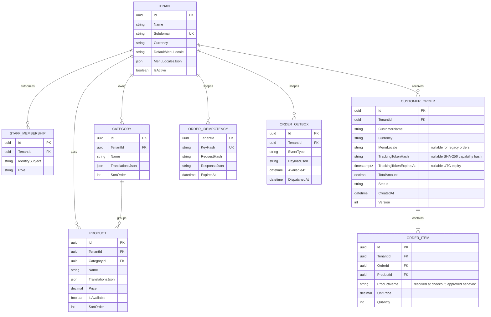

# Database schema and tenant model

Hosting update — 2026-10-06: the new Coolify `whiteplate` database was initialized from empty-target business/auth SQL. Queries confirmed all 9 EF history entries, 16 public tables and 6 auth tables; both localization migrations are included. Runtime roles, the API deployment, and the Vercel Production cutover are in place. Initial probes from the Coolify VPS confirmed Better Auth user lookup and JWKS over verified TLS; they created no account or business data. The operator later completed a hosted signup and email verification, created one organization and one acceptance restaurant, and loaded them in the signed-in Vercel session. The protected server-side `GET /api/v1/me` call and owner-protected kitchen page succeeded. The operator also reports that signed-out and alternate-account visits to that protected restaurant route redirected to `/fr?error=invalid_code`; this access-denial behavior is accepted without repeating the test. One account, organization and restaurant now exist in Coolify; no order has been created. Public storefront access remains open. Existing Neon data remains unchanged; see the [Coolify runbook](../deployment/coolify.md).

Status: organization, tenant, staff membership/invitation, catalog localization, localized order snapshots, idempotency, outbox, public tracking, and restaurant description translation mappings are implemented in EF Core/PostgreSQL. `DailyOrderHistory`, `PublicOrderTracking`, and `RestaurantDescriptionTranslations` were applied to Neon `test` on 2026-10-08. `PublicOrderTracking` was also reviewed and applied to Coolify Production on 2026-10-08. `RestaurantDescriptionTranslations` remains unapplied to Coolify Production. The feature application is not deployed there yet; hosted route acceptance remains open. Coolify has no scheduled database backup or completed restore drill.

## Implemented organization, tenant, catalog and order schema

Current EF model includes `Organizations`, `OrganizationOwnerMemberships`, `RestaurantMemberships`, `StaffInvitations`, `Tenants`, `MenuCategories`, `Products`, `ProductOptionGroups`, `ProductOptions`, `PromotionDiscounts`, `Orders`, `OrderLines`, `OrderLineOptions`, `OrderIdempotencyRecords`, and `OrderOutboxMessages`. Restaurant-owned catalog/order/idempotency/outbox rows carry `TenantId`. Catalog relationships use composite alternate keys and foreign keys so products, groups and options cannot reference another restaurant's parent. Order product and option labels/prices are immutable snapshots. Orders store nullable `MenuLocale`: new checkouts record the effective locale and pre-migration orders remain null. Public tracking adds nullable `TrackingTokenHash` and `TrackingTokenExpiresAt` to `Orders`; only a SHA-256 hash is persisted, with a 30-day expiry. See [decision 0006](../architecture/decisions/0006-public-order-tracking.md).

`CatalogLocalization` adds `Tenants.DefaultMenuLocale` and `Tenants.MenuLocalesJson`, plus a `TranslationsJson` text column on categories, products, option groups, and options. `RestaurantDescriptionTranslations` adds `Tenants.DescriptionTranslationsJson`, a required JSON map keyed by enabled locale and defaulting to `{}` for existing restaurants. Existing rows backfill to English with no extra translations or description. The tenant locale list is an open-ended JSON array of normalized language tags with a required default; there is no fixed language count. Item translation documents remain on their tenant-owned item rows. Product name/description, category name, option-group name, option name, and restaurant description can be translated. The public menu and checkout resolve missing text to the tenant default; no machine translation is performed. Restaurant owners/managers edit languages, catalog text, and restaurant descriptions through the protected API and localized management page. Startup migration is not automatic.

Tenant currency is restricted by Domain to EUR, GBP, or USD. Prices and totals use PostgreSQL numeric precision and C# decimals. Membership identity is issuer plus subject; invitations and idempotency keys are stored as hashes. Staff invitations also store the normalized intended recipient email; legacy invitations with a null email cannot be accepted. Order version and outbox leases are EF concurrency tokens. The seventh migration is `StaffInvitationRecipientEmail`. Review generated SQL before deployment. No startup migration runs automatically.

The Better Auth PostgreSQL adapter stores users, accounts, sessions, verification tokens, rate-limit records, and JWT signing keys in schema `auth`, separate from the EF-managed business schema. The Better Auth CLI owns that schema through `npm run auth:migrate`; EF migrations must not manage these tables. The auth tables are applied on Neon `test`; signup, verification, organization creation, invitation, and acceptance were verified there using locally intercepted email delivery. Vercel Production has also completed hosted email/password signup and verification, organization listing, an authenticated protected API request through the Coolify auth database, and owner access to a restaurant created through the Coolify API. The operator reports that signed-out and alternate-account access attempts to the protected restaurant route redirected to `/fr?error=invalid_code`; accept this frontend denial behavior. Hosted invitation acceptance remains unverified. Better Auth's CLI reports `rateLimit.lastRequest` as a type mismatch (`bigint/int8` in PostgreSQL versus `number` expected) on the test schema; track that warning during hosted acceptance. Apply and verify both schemas independently in each environment, and do not treat these runtime probes as full-schema acceptance.

`OrderIdempotencyRecords` enforces one key hash per tenant, retains a request hash and serialized create receipt for 24 hours, and references the tenant. `OrderOutboxMessages` records event ID, tenant, event payload, occurrence/availability timestamps, lease, retry count, and optional delivery timestamp. Creation/status changes and event records share one transaction. The outbox is at-least-once; consumers deduplicate by event ID.

## Implemented tenant registry

`WhitePlateDbContext` and `TenantConfiguration` live in Infrastructure. `InitialTenants` creates the original registry; `CatalogLocalization` adds the menu-language columns listed below:

| Column | PostgreSQL type | Constraints |
| --- | --- | --- |
| `Id` | `uuid` | Primary key, generated by Domain |
| `Name` | `varchar(200)` | Required; Domain trims and enforces nonempty |
| `Subdomain` | `varchar(63)` | Required, unique `IX_Tenants_Subdomain`; Domain normalizes lowercase DNS labels |
| `DefaultMenuLocale` | `varchar(128)` | Required; normalized language tag; migration defaults existing tenants to `en` |
| `MenuLocalesJson` | `text` | Required JSON array; at least one enabled tag and the default is included; no product-level count cap |
| `DescriptionTranslationsJson` | `text` | Required JSON object keyed by normalized locale; defaults to `{}`; values trimmed and limited to 500 characters |
| `IsActive` | `boolean` | Required; new tenants are active |

`Tenants` is global for host discovery and references its owning `Organization`. Tenant-owned catalog, order, idempotency, and outbox tables use tenant keys and explicit repository filters; catalog relationships use composite tenant foreign keys. The schema has no theme or global EF tenant filter. Inactive tenants retain their unique subdomain. PostgreSQL unique conflicts for the tenant-subdomain index become typed application conflicts, including concurrent attempts.

Supported tenant provisioning paths use domain normalization and reject reserved `www`, `api`, `admin`, `app` labels. Do not bypass them with raw imports: raw SQL must independently preserve those rules. Migrations never run automatically and contain no seed tenants. See [setup](../development.md#tenant-database-and-local-provisioning), [decision 0001](../architecture/decisions/0001-tenant-foundation.md), and [decision 0003](../architecture/decisions/0003-catalog-localization-and-tenant-domain-policy.md). Tests cover SQLite relational behavior, generated PostgreSQL SQL, and simulated provider errors. `CatalogLocalization` and `LocalizedOrderSnapshots` are applied on Neon `test` and Coolify Production; hosted business-flow acceptance remains open.

## Model scope

The current design uses a shared database and schema, with a `TenantId` on tenant-owned business records. The following early ERD is conceptual and predates the approved first-release model: `SHOPPING_CART` and `CART_ITEM` are excluded, and the implemented schema above is authoritative. A tenant ID provides a scoping key; it does not guarantee isolation by itself.

Names in this ERD are conceptual, not generated SQL. `CUSTOMER_ORDER` avoids ambiguity with SQL `ORDER`. `STAFF_MEMBERSHIP` represents persisted issuer/subject access; Better Auth owns account passwords and sessions in a separate schema.

The first release has no persisted guest cart, payment, inventory reservation, or pickup scheduling. The browser cart is tenant-scoped ephemeral Zustand state. Checkout accepts a submitted order request and persists the order snapshots and idempotency receipt. Public status tracking uses the expiring hashed capability described in decision 0006.

## Required constraints for implementation

- Each row has a primary key. Tenant-owned rows require a non-null tenant foreign key.
- Give each referenced tenant-owned entity a unique key on `(TenantId, Id)`. Use composite foreign keys for product-to-category and item-to-order/product relations, so a valid ID from another restaurant cannot be linked accidentally.
- Persisted carts are excluded from the approved first release. If they are added later, scope both the cart and every item to `TenantId`, constrain the token hash within a tenant, and treat possession of the raw cart token as the capability; never authorize by cart UUID alone.
- Normalize and uniquely constrain tenant subdomains; define allowed characters, reserved names, inactive-tenant behavior, and custom-domain handling before onboarding.
- Constrain quantity to positive integers and monetary amounts to nonnegative values. Use the implemented PostgreSQL numeric precision/scale and matching C# decimal handling, not binary floating-point. Currency is EUR, USD, or GBP with two decimal places; line amounts round `AwayFromZero`.
- Store currency, product/option names, prices, tax, discount, and totals on the order and line snapshots. Historical totals survive future menu edits. Checkout computes one non-stacking discount, allocates it across lines, then calculates line tax.
- Restrict persisted status values to `Pending`, `Preparing`, `Ready`, `Completed`, and `Cancelled`. Application logic enforces forward transitions; EF's version concurrency token supports `If-Match`.
- Store order timestamps as UTC instants (`timestamptz`). `ClosedAt` and `ClosedAtTicks` record when an order first enters `Completed` or `Cancelled`; `ArchivedAt` records its removal from the kitchen board. The daily archive uses UTC midnight because restaurants do not yet have a configured timezone. Archive operations retain status and order snapshots.
- Preserve ordered products through archival or restricted deletion; do not cascade-delete historical orders when a product/category is removed. Define order/customer retention and tenant deletion policy before destructive operations.

An order requires at least one item. A simple row-level check cannot enforce the entire parent/child invariant; validate it in the use case and save the order/items transactionally. The ERD cardinality expresses the business invariant, not an automatic SQL guarantee.

## Index and transaction design

Tenant-leading indexes support category/product ordering, order retrieval, idempotency retention, and outbox claiming. Idempotency key hashes are unique with `TenantId`; the kitchen list uses `(TenantId, CreatedAtTicks, Id)`, and the archive worker uses `(Status, ClosedAtTicks, ArchivedAt)`. Verify indexes against actual query plans rather than assuming every example is necessary.

Checkout resolves all products/options within one tenant, validates availability, calculates snapshots, and saves the order, 24-hour idempotency receipt, and outbox event atomically. A response retry with the same key and normalized request returns the persisted receipt. `IsAvailable` is a menu toggle, not a stock quantity/reservation system; concurrent availability changes do not promise stock guarantees.

Concurrent status updates use the order version as an EF concurrency token and require `If-Match`. The outbox stores events in the same transaction as order writes, uses tenant scoping and expiring leases, and schedules failed deliveries for retry. Delivery is at least once.

## Isolation and migrations

Future EF global filters can help scope reads, but they can be disabled and are not write authorization. Protect insertion/update/delete paths, raw SQL, maintenance operations, jobs, and relationship assignment separately. See [tenant security](../architecture/tenancy-and-security.md) and [Microsoft's query-filter reference](https://learn.microsoft.com/en-us/ef/core/querying/filters).

The migration history uses EF Core 10.0.12/Npgsql 10.0.3 and external connection configuration. The daily order-history migration backfills existing terminal orders' close time from `CreatedAt`; the startup worker archives rows already past the current UTC boundary on startup and catches up missed runs without deleting them. New terminal orders from the current UTC day are archived at the next midnight. Two-tenant fixtures cover catalog/order access. Review migration SQL and test it on a branch; never auto-apply changes to production merely because an app starts. `CatalogLocalization` and `LocalizedOrderSnapshots` are applied on the current Neon `test` branch. Coolify Production has all 11 checked-in migrations, including `DailyOrderHistory` and `PublicOrderTracking`. The latter was applied after confirming no existing order rows and that both tracking columns were absent; verification then confirmed its history row, both columns and zero order rows. Hosted tracking remains pending until the feature code is deployed and exercised.

The accepted design allows each restaurant to enable any number of menu languages (minimum one) with a required default. Catalog translation maps are stored on tenant-owned rows, and missing entries use the default language. Both localization migrations are applied on Neon `test` and Coolify Production. Neon `test` browser acceptance covers localized public menus and checkout order snapshots; hosted public tenant storefront/checkout acceptance remains open pending public tenant DNS/TLS. See [decision 0003](../architecture/decisions/0003-catalog-localization-and-tenant-domain-policy.md), [API contracts](../api/api-contracts.md), and [functional acceptance checks](../functional-test-plan.md).
